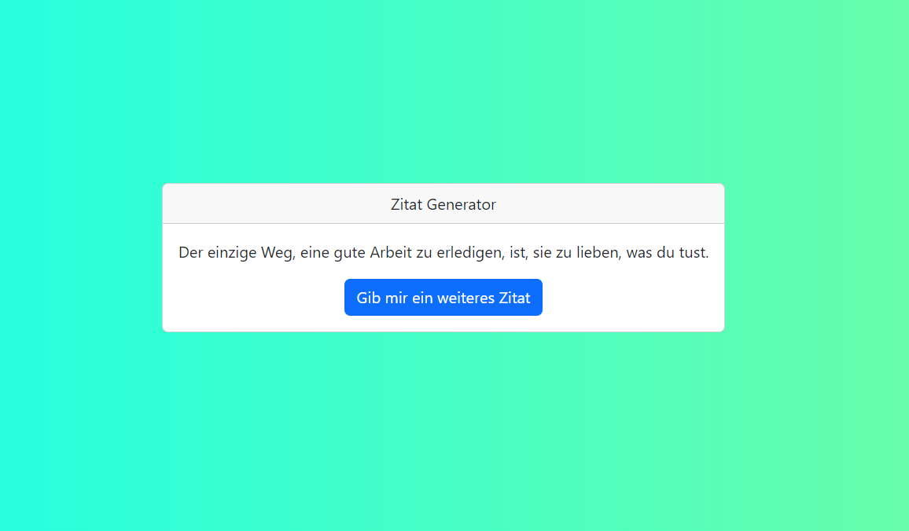

# Projektname: Zitat Generator

## Screenshot



## Projektbeschreibung

Während einer nachmittäglichen Lerneinheit habe ich gemeinsam mit meiner Dozentin eine kleine Session zu TypeScript und Bootstrap durchgeführt. Ziel war es, eine praxisnahe Einführung in TypeScript zu erhalten.

## Installation

1. Klone dir das Repository

   ```git
   git clone
   ```

2. Wechsel in den Ordner Zitat Generator

   ```
   cd Zitat-Generator
   ```

3. Öffne die Ansicht des Projektes, indem du die index.html mit Five Server öffnest
   ```
   Rechts Klick auf die index.html
    -> Open with Five Server
   ```
